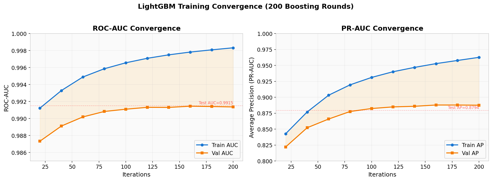
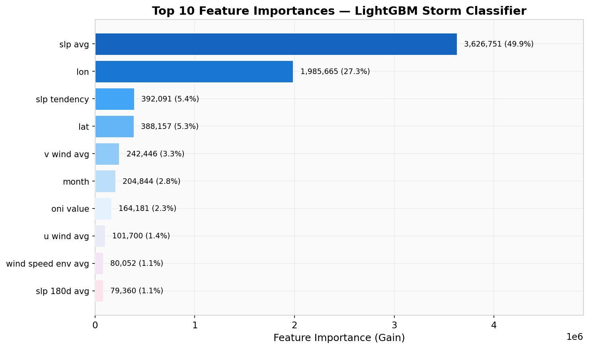
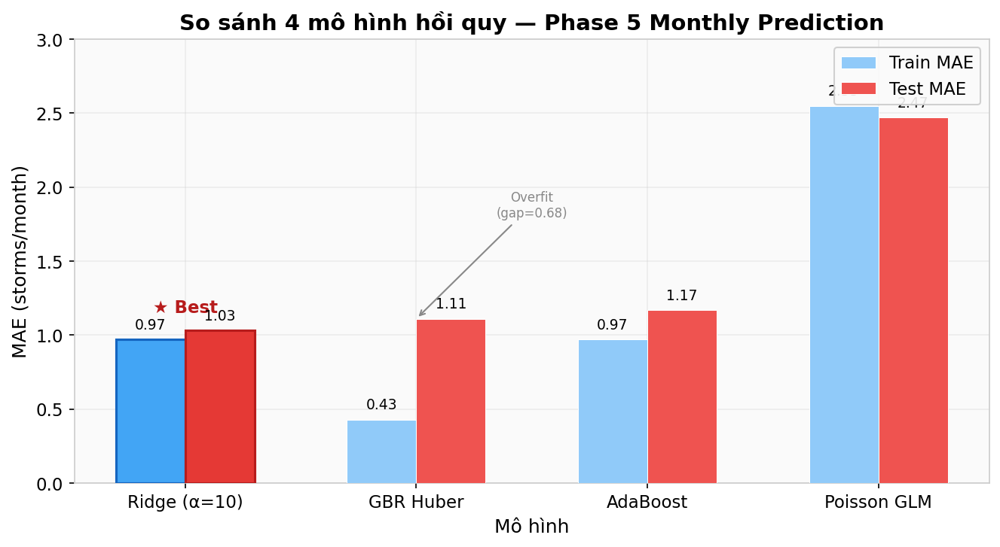
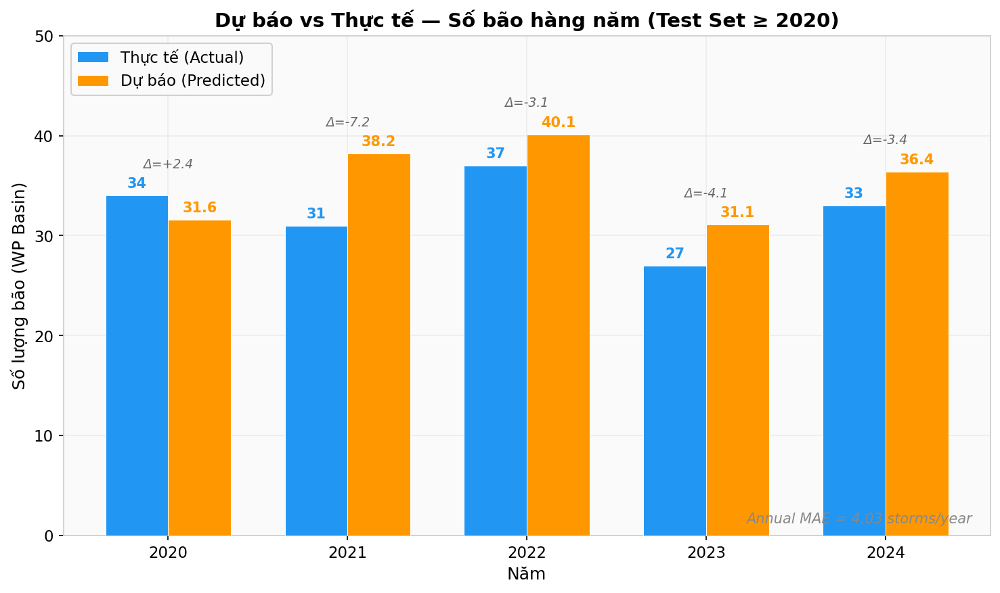
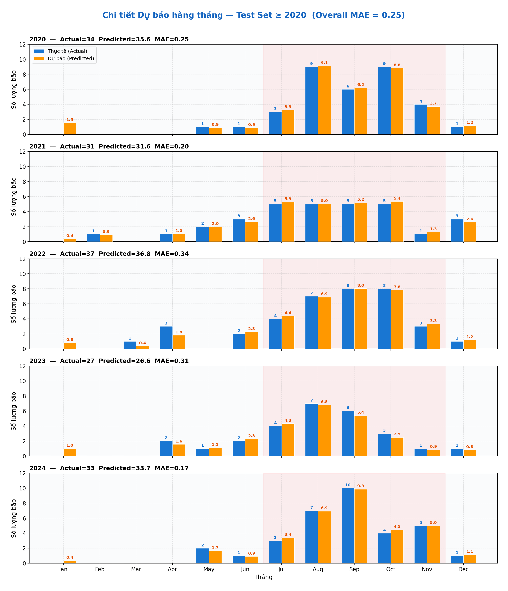
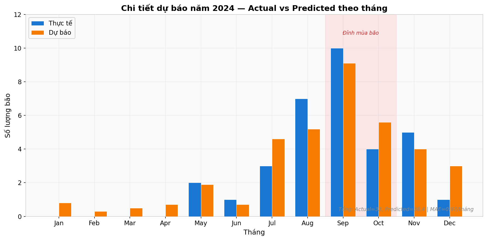
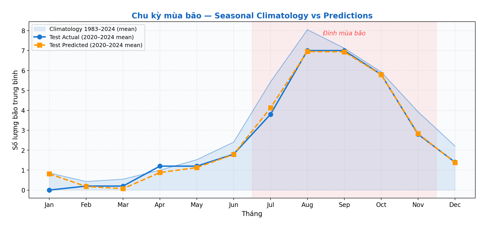
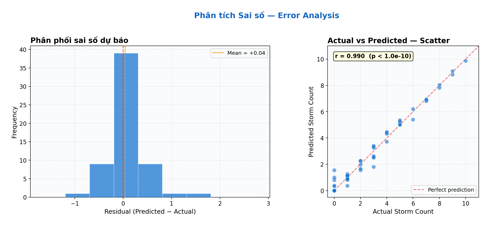
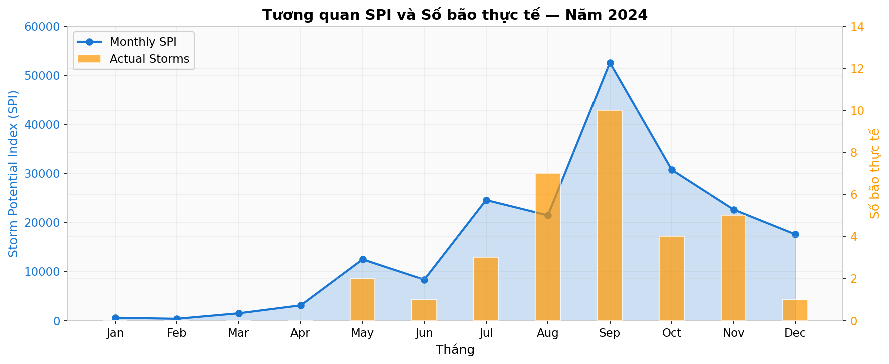
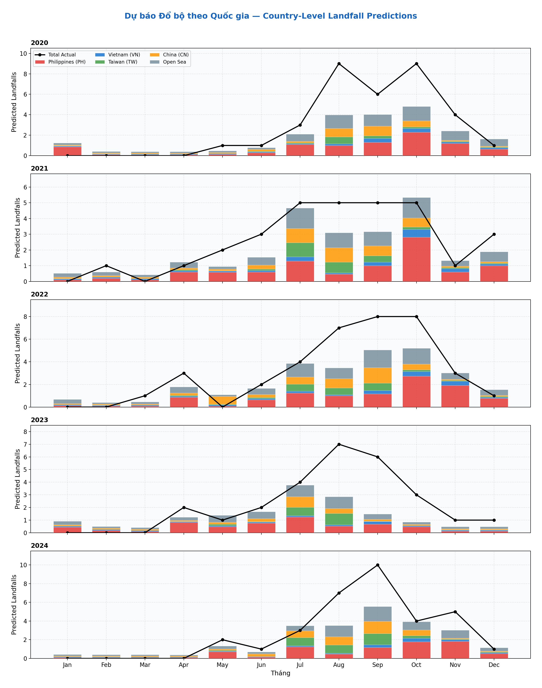

# WeatherPredict 🌪️

[Vietnamese Version](#phiên-bản-tiếng-việt) | [English Version](#english-version)

---

> ⚠️ **Compute & Storage Requirements**
> - **Disk:** ~150 GB+ (raw ERA5 GRIB, NOAA SST NetCDF, IBTrACS CSV, plus Parquet conversions and the ~225M-row master dataset)
> - **RAM:** 10–16 GB recommended for PySpark driver + executor; Phase 4 LightGBM training fits in ~4 GB pandas
> - **CPU / Time:** Full pipeline ~3 hours first run (rolling feature computation dominates); cached reruns ~20 min; Phase 5-only from cache ~3 min. A 2-node Spark cluster cuts wall-clock by ~40%
> - **Conda environment:** `pyspark` with Python 3.11+

---

### Project Summary
**WeatherPredict** is a bottom-up tropical cyclone forecasting pipeline. It predicts **monthly storm counts** by first classifying storm presence at every 0.25° grid cell per day, then rolling up probabilities into a Storm Potential Index (SPI).
**Domain:** South China Sea / Western Pacific, 1983–2024.

### Tech Stack
- **Data Engineering:** PySpark (rolling features, joins, distributed inference via `mapInPandas`)
- **Micro-level Classifier:** LightGBM (native Python API)
- **Monthly Regression:** statsmodels (ZINB) + lightgbm (Tweedie) + scikit-learn (Ridge meta-learner); legacy mode: scikit-learn Poisson GridSearchCV
- **Local Training & Processing:** pandas / numpy / scipy
- **Visualization:** Streamlit (`app/app.py`)
- **Environment:** Python 3.11+, Conda env: `pyspark`

### Data Sources & Extraction

The pipeline integrates four independent environmental and storm datasets into a single **~225M-row master dataset** at 0.25° daily resolution (South China Sea / Western Pacific, 1983–2024).

| Dataset | Source | Download URL | Raw Format | Variables Extracted | Preprocessing Script |
|---------|--------|-------------|-----------|---------------------|---------------------|
| **ERA5 Reanalysis** | Copernicus Climate Data Store | [cds.climate.copernicus.eu](https://cds.climate.copernicus.eu/datasets/reanalysis-era5-single-levels?tab=download) | GRIB → Parquet | `u_wind_avg`, `v_wind_avg` (10m wind components, m/s), `slp_avg` (Mean Sea Level Pressure, Pa), `wind_speed_env_avg` (scalar wind speed, m/s) | `helpers/preprocess_era5.py` |
| **NOAA OISST v2.1** | NOAA Physical Sciences Laboratory | [psl.noaa.gov/data/gridded/data.noaa.oisst.v2.html](https://psl.noaa.gov/data/gridded/data.noaa.oisst.v2.html) | NetCDF (`.nc`) → Parquet | `sst_avg` (Sea Surface Temperature, °C) | `helpers/convert_sst.py` |
| **IBTrACS v04r01** | NOAA NCEI International Best Track Archive | [ncei.noaa.gov/products/international-best-track-archive](https://www.ncei.noaa.gov/products/international-best-track-archive) | CSV → Parquet | `SID` (storm ID), `NAME`, `wind_speed_kmh`, `pressure_wmo`, `lat`, `lon` — used as **binary storm-presence labels** at grid-cell level | `helpers/preprocess_ibtracs.py` |
| **ONI (Oceanic Niño Index)** | NOAA CPC | [cpc.ncep.noaa.gov/products/analysis_monitoring/ensostuff/detrend.nino34.ascii.txt](https://www.cpc.ncep.noaa.gov/products/analysis_monitoring/ensostuff/detrend.nino34.ascii.txt) | CSV | `oni_value` (monthly ENSO index), `enso_phase` (0=Neutral, 1=El Niño, 2=La Niña) | Joined directly in `helpers/spatio_temporal_join.py` |

**Extraction pipeline:** `helpers/spatio_temporal_join.py` performs the year-by-year spatio-temporal join — ERA5 daily aggregates + SST snapped to the same 0.25° grid + ONI joined by year/month + IBTrACS storm tracks joined by lat/lon/date — producing `parquet_data/master_dataset.parquet`.

**Feature engineering** (`models/phase1_features.py`): Rolling averages over 7/14/30/90/180-day windows per grid cell, plus physics-informed derived features:
- `sst_above_threshold` — binary flag for SST ≥ 26.5°C (cyclogenesis threshold)
- `sst_anomaly` — SST deviation from 180-day trailing mean
- `slp_tendency` — 7-day sea-level pressure change rate

**Landfall spatial transition matrix** (`helpers/extract_landfall_grid.py`): Bayesian-smoothed (Laplace α=5) probability matrix mapping each 0.25° grid cell to the historical landfall destination distribution (VN, PH, CN, JP, TW, Open Sea) based on IBTrACS track trajectories.

### Model Architecture

The pipeline uses a **two-level stacked ensemble** for monthly storm count prediction:

**Level 1 — Grid-level classifier** (Phase 4): **LightGBM** binary classifier predicts storm presence probability (`prob_storm`) at each 0.25° grid cell per day. ROC-AUC ~0.99. Features include spatial coordinates, temporal month, raw environmental variables, rolling averages, and derived physics features.

**Level 2 — Monthly regression ensemble** (Phase 5): Three heterogeneous base learners feed a **Ridge meta-learner**:

| Base Model | Library | Why |
|------------|---------|-----|
| **ZINB** (Zero-Inflated Negative Binomial) | statsmodels | Handles the two sources of zeros in storm counts: (1) structural zeros — months with no storms are common, (2) sampling zeros — months where storms exist but didn't cross a specific country. The ZINB mixture model explicitly separates these zero-generating processes via a logit inflation component alongside a negative binomial count component. *(See [Fukami Lab — Zero-Inflated Count Data](https://fukamilab.github.io/BIO202/04-C-zero-data.html) for the mathematical framework: E(Y) = μ·(1−π), where π is the zero-inflation probability.)* Falls back to NegativeBinomialP on convergence failure. |
| **Tweedie LightGBM** | lightgbm | Tree-based gradient boosting with Tweedie loss (variance power=1.5) — naturally handles zero-inflated, right-skewed count data without explicit zero-modeling. |
| **Ridge meta-learner** | scikit-learn | Linear combination of ZINB and LightGBM predictions (positive-constrained coefficients). Trained via **expanding-window walk-forward CV** (2016–2019) to prevent temporal leakage. |

**7 targets trained in parallel** via ThreadPoolExecutor: total storm count + 6 country-specific landfall counts (VN, PH, CN, JP, TW, Open Sea), each using the same stacked architecture with target-specific SPI features derived from the landfall transition matrix.

### Pipeline Phases
1. **Feature Engineering** (`phase1_features.py`): Rolling averages (7/14/30/90/180 day) + derived features. Persistently cached to eliminate redundant calculation.
2. **Undersampling** (`phase2_sampling.py`): 1:20 positive/negative ratio via fast uniform sampling.
3. **Temporal Split** (`phase3_split.py`): Train ≤2015, Val 2016–2019, Test ≥2020. No random splits to prevent data leakage.
4. **LightGBM Classifier** (`phase4_classifier.py`): Trains on pandas. Outputs grid-level probability: `prob_storm` (ROC-AUC ~0.99).
5. **Monthly Roll-Up** (`phase5_rollup.py`): `mapInPandas` inference + Landfall Spatial Transition Matrix → Country-specific SPIs → Phase 5 Stacked Ensemble (ZINB + Tweedie LightGBM + Ridge) → Country-level landfall predictions.

#### Data Expectations per Phase

| Phase | Input | Output | Expected Size |
|-------|-------|--------|---------------|
| **Phase 1** Feature Engineering | `master_dataset.parquet` (raw) | `features_checkpoint.parquet` | ~225M rows × 24 columns. Cached to disk (~1.5h first run, ~30s reload). |
| **Phase 2** Undersampling | Full feature DataFrame (225M rows) | `training_base` (1:20 pos/neg) | ~727K rows (34,595 positives + 692,487 negatives). 99.7% of negatives discarded. |
| **Phase 3** Temporal Split | `training_base` (727K rows) | `train_df`, `val_df`, `test_df` | **Train** ≤2015: ~572K rows (27,601 pos / 543,993 neg). **Val** 2016–2019: ~69K rows (3,339 pos / 66,000 neg). **Test** ≥2020: ~86K rows (3,655 pos / 82,494 neg). |
| **Phase 4** Classifier | 3 pandas DataFrames (~727K total) | `lgbm_storm_classifier.pkl`, `probability_calibrator.pkl`, `train_means.pkl` | 200 boosting rounds, ROC-AUC ~0.97 (val), ~0.97 (test). Isotonic calibration corrects raw mean from 0.118 → 0.048. |
| **Phase 5** Monthly Roll-Up | Full 225M rows + Phase 4 model | `phase5_monthly_cache.parquet` → 7 trained ensemble models | **Inference:** 225M rows via `mapInPandas`. **Monthly cache:** ~500 rows (42 years × 12 months). **Targets:** 7 (total count + 6 country landfalls). Test MAE ~1.03 storms/month. |

### How to Run

**1. Setup Environment**
```bash
conda activate pyspark
pip install -r requirements.txt
```

**2. Running the Pipeline**
```bash
# Full pipeline (first run: ~3 hours; cached: ~20 min)
python -m models.bottom_up_forecast

# Prepare monthly cache only — no training
python -m models.bottom_up_forecast --prepare

# Train Phase 5 from cache — no Spark needed (~3 min)
python -m models.bottom_up_forecast --phase5
```

**3. Using the Interactive Training Script (Recommended)**
```bash
./models/train.zsh              # Interactive menu
./models/train.zsh bottom_up    # Full pipeline
./models/train.zsh prepare      # Build monthly cache
./models/train.zsh phase5       # Train from cache
```

**4. Dashboard**
```bash
streamlit run app/app.py        # Phase 5 predictions (Actual vs Predicted)
```

**5. Cluster Mode (2-node Standalone)**
See `docs/cluster_setup.md` for full instructions.

### Important Constraints
- **No SynapseML:** Use native `lightgbm` Python API only. SynapseML causes `JavaPackage` errors.
- **No random splits:** Time-based splits only. Future data must never leak into training.
- **Inference requires `mapInPandas`:** Uses a broadcasted pickled model dynamically applied. Do not try `spark.ml` transformers.
- **Two-level caching:** Phase 1 features (`features_checkpoint.parquet`) and Monthly data (`phase5_monthly_cache.parquet`) significantly shortcut training times on reruns.

### Results & Visualizations

#### Phase 4 — LightGBM Grid-Level Storm Classifier

**Training Convergence** — ROC-AUC and PR-AUC over 200 boosting rounds. Validation AUC = 0.9915.



**Top 10 Feature Importances** — Sea-level pressure (`slp_avg`) and geographic location (`lon`, `lat`) dominate.



#### Phase 5 — Monthly Storm Count Predictions

**Model Comparison** — Ridge (α=10) achieves the lowest Test MAE = 1.03 with minimal overfit.



**Annual Totals (Test Set ≥ 2020)** — Predicted vs actual annual storm counts. Annual MAE = 4.05 storms/year.



**Monthly Detail by Year** — Faceted actual vs predicted for each test year. Overall monthly MAE = 0.25.



**2024 Monthly Forecast** — Detailed view of the most recent forecast year with peak season highlighted.



**Seasonal Climatology** — Model predictions closely follow the 42-year historical pattern (1983–2024).



**Error Analysis** — Residual distribution (mean = +0.04) and scatter plot (Pearson r = 0.990).



**SPI Correlation (2024)** — Storm Potential Index tracks observed storm count throughout the year.



**Country-Level Landfall Predictions** — Stacked breakdown by Philippines, Vietnam, Taiwan, China, Japan, and Open Sea.



---

## Phiên bản Tiếng Việt

> ⚠️ **Yêu cầu về Lưu trữ & Tính toán**
> - **Ổ đĩa:** ~150 GB+ (dữ liệu thô ERA5 GRIB, NOAA SST NetCDF, IBTrACS CSV, cộng với các bản chuyển đổi Parquet và master dataset ~225 triệu dòng)
> - **RAM:** 10–16 GB khuyến nghị cho PySpark driver + executor; Phase 4 LightGBM huấn luyện trên pandas chỉ cần ~4 GB
> - **CPU / Thời gian:** Pipeline đầy đủ ~3 giờ lần đầu (tính toán đặc trưng trượt chiếm phần lớn thời gian); chạy lại có cache ~20 phút; chỉ Phase 5 từ cache ~3 phút. Cụm Spark 2 node giảm thời gian chờ ~40%
> - **Môi trường Conda:** `pyspark` với Python 3.11+

---

### Tổng quan Dự án
**WeatherPredict** là một pipeline dự báo bão nhiệt đới theo phương pháp từ dưới lên (bottom-up). Hệ thống dự đoán **số lượng bão hàng tháng** bằng cách trước tiên phân loại sự hiện diện của bão tại mỗi ô lưới 0.25° mỗi ngày, sau đó tổng hợp các xác suất này thành Chỉ số Tiềm năng Bão (Storm Potential Index - SPI).
**Phạm vi không gian:** Biển Đông / Tây Thái Bình Dương, 1983–2024.

### Công nghệ sử dụng
- **Data Engineering:** PySpark (tính toán đặc trưng dạng trượt - rolling features, join, suy luận phân tán qua `mapInPandas`)
- **Phân loại vi mô (Micro-level):** LightGBM (Native Python API)
- **Hồi quy hàng tháng:** statsmodels (ZINB) + lightgbm (Tweedie) + scikit-learn (Ridge meta-learner); chế độ legacy: scikit-learn Poisson GridSearchCV
- **Huấn luyện & Xử lý cục bộ:** pandas / numpy / scipy
- **Trực quan hóa:** Streamlit (`app/app.py`)
- **Môi trường:** Python 3.11+, Conda env: `pyspark`

### Nguồn dữ liệu & Trích xuất

Pipeline tích hợp bốn bộ dữ liệu môi trường và bão độc lập thành một **master dataset ~225 triệu dòng** với độ phân giải 0.25° hàng ngày (Biển Đông / Tây Thái Bình Dương, 1983–2024).

| Bộ dữ liệu | Nguồn | URL Tải về | Định dạng gốc | Các biến trích xuất | Script tiền xử lý |
|-------------|-------|-----------|---------------|---------------------|-------------------|
| **ERA5 Reanalysis** | Copernicus Climate Data Store | [cds.climate.copernicus.eu](https://cds.climate.copernicus.eu/datasets/reanalysis-era5-single-levels?tab=download) | GRIB → Parquet | `u_wind_avg`, `v_wind_avg` (thành phần gió 10m, m/s), `slp_avg` (Áp suất mực nước biển, Pa), `wind_speed_env_avg` (tốc độ gió vô hướng, m/s) | `helpers/preprocess_era5.py` |
| **NOAA OISST v2.1** | NOAA Physical Sciences Laboratory | [psl.noaa.gov/data/gridded/data.noaa.oisst.v2.html](https://psl.noaa.gov/data/gridded/data.noaa.oisst.v2.html) | NetCDF (`.nc`) → Parquet | `sst_avg` (Nhiệt độ bề mặt biển, °C) | `helpers/convert_sst.py` |
| **IBTrACS v04r01** | NOAA NCEI International Best Track Archive | [ncei.noaa.gov/products/international-best-track-archive](https://www.ncei.noaa.gov/products/international-best-track-archive) | CSV → Parquet | `SID` (mã bão), `NAME`, `wind_speed_kmh`, `pressure_wmo`, `lat`, `lon` — được dùng làm **nhãn sự hiện diện bão** ở mức ô lưới | `helpers/preprocess_ibtracs.py` |
| **ONI (Oceanic Niño Index)** | NOAA CPC | [cpc.ncep.noaa.gov/products/analysis_monitoring/ensostuff/detrend.nino34.ascii.txt](https://www.cpc.ncep.noaa.gov/products/analysis_monitoring/ensostuff/detrend.nino34.ascii.txt) | CSV | `oni_value` (chỉ số ENSO hàng tháng), `enso_phase` (0=Trung tính, 1=El Niño, 2=La Niña) | Kết nối trực tiếp trong `helpers/spatio_temporal_join.py` |

**Pipeline trích xuất:** `helpers/spatio_temporal_join.py` thực hiện kết nối không-thời gian theo từng năm — tổng hợp ERA5 hàng ngày + SST được ghim vào cùng lưới 0.25° + ONI kết nối theo năm/tháng + vết bão IBTrACS kết nối theo vĩ/kinh độ/ngày — tạo ra `parquet_data/master_dataset.parquet`.

**Trích xuất đặc trưng** (`models/phase1_features.py`): Trung bình trượt qua các cửa sổ 7/14/30/90/180 ngày cho mỗi ô lưới, cùng các đặc trưng dẫn xuất dựa trên vật lý:
- `sst_above_threshold` — cờ nhị phân cho SST ≥ 26.5°C (ngưỡng hình thành bão)
- `sst_anomaly` — độ lệch SST so với trung bình trượt 180 ngày
- `slp_tendency` — tốc độ thay đổi áp suất mực nước biển trong 7 ngày

**Ma trận chuyển đổi không gian đổ bộ** (`helpers/extract_landfall_grid.py`): Ma trận xác suất được làm mượt Bayesian (Laplace α=5) ánh xạ mỗi ô lưới 0.25° đến phân phối đích đổ bộ lịch sử (VN, PH, CN, JP, TW, Ngoài khơi) dựa trên quỹ đạo vết bão IBTrACS.

### Kiến trúc Mô hình

Pipeline sử dụng **ensemble xếp chồng hai tầng** để dự báo số lượng bão hàng tháng:

**Tầng 1 — Phân loại mức ô lưới** (Phase 4): **LightGBM** phân loại nhị phân dự đoán xác suất hiện diện bão (`prob_storm`) tại mỗi ô lưới 0.25° mỗi ngày. ROC-AUC ~0.99. Đặc trưng bao gồm tọa độ không gian, tháng thời gian, biến môi trường thô, trung bình trượt và đặc trưng vật lý dẫn xuất.

**Tầng 2 — Ensemble hồi quy hàng tháng** (Phase 5): Ba mô hình cơ sở dị thể kết hợp với **meta-learner Ridge**:

| Mô hình cơ sở | Thư viện | Lý do |
|----------------|----------|-------|
| **ZINB** (Zero-Inflated Negative Binomial) | statsmodels | Xử lý hai nguồn số 0 trong số lượng bão: (1) số 0 cấu trúc — tháng không có bão là phổ biến, (2) số 0 lấy mẫu — tháng có bão nhưng không đổ bộ qua quốc gia cụ thể. Mô hình hỗn hợp ZINB tách biệt rõ ràng các quá trình tạo số 0 thông qua thành phần lạm phát logit cùng với thành phần đếm nhị thức âm. *(Xem [Fukami Lab — Zero-Inflated Count Data](https://fukamilab.github.io/BIO202/04-C-zero-data.html) cho khung toán học: E(Y) = μ·(1−π), với π là xác suất lạm phát số 0.)* Chuyển về NegativeBinomialP khi hội tụ thất bại. |
| **Tweedie LightGBM** | lightgbm | Gradient boosting dạng cây với hàm mất mát Tweedie (số mũ phương sai=1.5) — tự nhiên xử lý dữ liệu đếm có nhiều số 0, lệch phải mà không cần mô hình hóa số 0 tường minh. |
| **Ridge meta-learner** | scikit-learn | Tổ hợp tuyến tính các dự đoán ZINB và LightGBM (hệ số bị chặn dương). Huấn luyện bằng **CV mở rộng cửa sổ trượt** (2016–2019) để tránh rò rỉ thời gian. |

**7 mục tiêu huấn luyện song song** qua ThreadPoolExecutor: tổng số bão + 6 mục tiêu đổ bộ theo quốc gia (VN, PH, CN, JP, TW, Ngoài khơi), mỗi mục tiêu sử dụng kiến trúc xếp chồng tương tự với đặc trưng SPI riêng được dẫn xuất từ ma trận chuyển đổi đổ bộ.

### Các Giai đoạn của Pipeline
1. **Trích xuất Đặc trưng** (`phase1_features.py`): Tính trung bình trượt (7/14/30/90/180 ngày) + các đặc trưng dẫn xuất. Được lưu cache vĩnh viễn hạn chế tính toán lại dư thừa.
2. **Undersampling** (`phase2_sampling.py`): Giảm mẫu theo tỷ lệ 1:20 (có bão/không bão) bằng phương pháp lấy mẫu đồng đều nhanh.
3. **Chia tập Dữ liệu theo Thời gian** (`phase3_split.py`): Train ≤2015, Val 2016–2019, Test ≥2020. Hoàn toàn không chia tách ngẫu nhiên (chống rò rỉ dữ liệu chiều tương lai).
4. **Mô hình LightGBM** (`phase4_classifier.py`): Huấn luyện trên pandas. Trả về xác suất mức độ ô lưới `prob_storm` (ROC-AUC ~0.99).
5. **Tổng hợp hàng Tháng** (`phase5_rollup.py`): Suy luận phân tán bằng `mapInPandas` + Ma trận Chuyển đổi Không gian Đổ bộ (Landfall Transition Matrix) → SPI theo Quốc gia → Ensemble Mô hình Phase 5 (ZINB + Tweedie LightGBM + Ridge) → Dự báo số lượng bão đổ bộ cấp quốc gia học đa luồng (multi-threaded).

#### Kỳ vọng Dữ liệu theo từng Giai đoạn

| Giai đoạn | Đầu vào | Đầu ra | Kích thước Kỳ vọng |
|-----------|---------|--------|---------------------|
| **Phase 1** Trích xuất Đặc trưng | `master_dataset.parquet` (thô) | `features_checkpoint.parquet` | ~225 triệu dòng × 24 cột. Lưu cache ra đĩa (~1,5h lần đầu, ~30s tải lại). |
| **Phase 2** Undersampling | DataFrame đặc trưng đầy đủ (225M dòng) | `training_base` (tỷ lệ 1:20) | ~727K dòng (34,595 dương + 692,487 âm). 99,7% mẫu âm bị loại bỏ. |
| **Phase 3** Chia theo Thời gian | `training_base` (727K dòng) | `train_df`, `val_df`, `test_df` | **Train** ≤2015: ~572K dòng (27,601 dương / 543,993 âm). **Val** 2016–2019: ~69K dòng (3,339 dương / 66,000 âm). **Test** ≥2020: ~86K dòng (3,655 dương / 82,494 âm). |
| **Phase 4** Phân loại | 3 DataFrame pandas (~727K tổng) | `lgbm_storm_classifier.pkl`, `probability_calibrator.pkl`, `train_means.pkl` | 200 vòng boosting, ROC-AUC ~0,97 (val), ~0,97 (test). Hiệu chỉnh isotonic điều chỉnh giá trị trung bình thô từ 0,118 → 0,048. |
| **Phase 5** Tổng hợp Tháng | 225M dòng đầy đủ + mô hình Phase 4 | `phase5_monthly_cache.parquet` → 7 mô hình ensemble | **Suy luận:** 225M dòng qua `mapInPandas`. **Cache hàng tháng:** ~500 dòng (42 năm × 12 tháng). **Mục tiêu:** 7 (tổng bão + 6 đổ bộ quốc gia). Test MAE ~1,03 bão/tháng. |

### Hướng dẫn Chạy

**1. Cài đặt Môi trường**
```bash
conda activate pyspark
pip install -r requirements.txt
```

**2. Chạy Pipeline**
```bash
# Chạy toàn bộ pipeline (Lần đầu: ~3 giờ; Đã cache: ~20 phút)
python -m models.bottom_up_forecast

# Chỉ tính toán và chuẩn bị bộ cache hàng tháng — không huấn luyện
python -m models.bottom_up_forecast --prepare

# Chạy Phase 5 từ bộ cache — không cần module Spark (~3 phút)
python -m models.bottom_up_forecast --phase5
```

**3. Dùng Script Huấn luyện Tương tác (Khuyên dùng)**
```bash
./models/train.zsh              # Hiện menu tương tác
./models/train.zsh bottom_up    # Chạy toàn bộ pipeline
./models/train.zsh prepare      # Tạo bộ cache hàng tháng
./models/train.zsh phase5       # Huấn luyện Phase 5 trực tiếp từ cache
```

**4. Giao diện Dashboard**
```bash
streamlit run app/app.py        # Dự báo từ Phase 5 (Thực tế vs Dự báo)
```

**5. Chế độ Cluster (Cụm 2 node Standalone)**
Vui lòng tham khảo tệp `docs/cluster_setup.md` để biết thêm chi tiết phương pháp cấu hình mạng linh hoạt.

### Ràng buộc & Lưu ý Quan trọng
- **Không dùng SynapseML:** Chỉ sử dụng native `lightgbm` Python API. Chạy LightGBM bằng SynapseML trong môi trường này gây ra lỗi khởi tạo `JavaPackage`.
- **Không chia dữ liệu ngẫu nhiên (No random splits):** Bắt buộc chỉ chia dữ liệu theo chiều thời gian (Time-based).
- **Suy luận bằng `mapInPandas`:** Thực hiện bằng việc truyền mô hình đã pickle sang các worker (broadcast state). Khác so với truyền thống của Spark ML.
- **Caching 2 lớp:** Đặc trưng Phase 1 (`features_checkpoint.parquet`) và Dữ liệu hàng tháng (`phase5_monthly_cache.parquet`) được lưu trữ độc lập để bỏ qua tính toán phân tán đắt đỏ bằng Spark ở các lần chạy khởi tạo lại.

### Kết quả & Trực quan hóa

#### Phase 4 — Phân loại Bão ở mức Ô lưới (LightGBM)

**Đường cong Hội tụ** — ROC-AUC và PR-AUC qua 200 vòng boosting. Validation AUC = 0.9915.


**Top 10 Đặc trưng Quan trọng nhất** — Áp suất mực nước biển (`slp_avg`) và vị trí địa lý (`lon`, `lat`) chiếm ưu thế.


#### Phase 5 — Dự báo Số lượng Bão hàng Tháng

**So sánh Mô hình** — Ridge (α=10) đạt Test MAE thấp nhất = 1.03, ít overfit nhất.


**Tổng số Bão hàng Năm (Test ≥ 2020)** — So sánh tổng số bão dự báo vs thực tế. MAE hàng năm = 4.05 bão/năm.


**Chi tiết Dự báo hàng Tháng** — So sánh thực tế vs dự báo cho từng năm test. MAE tổng = 0.25.


**Dự báo năm 2024** — Chi tiết dự báo tháng với vùng đỉnh mùa bão được đánh dấu.


**Chu kỳ Mùa bão** — Dự báo bám sát quy luật khí hậu 42 năm (1983–2024).


**Phân tích Sai số** — Phân phối sai số (mean = +0.04) và biểu đồ phân tán (Pearson r = 0.990).


**Tương quan SPI (2024)** — Chỉ số Tiềm năng Bão (SPI) phản ánh chính xác đỉnh mùa bão trong năm.


**Dự báo Đổ bộ theo Quốc gia** — Philippines, Việt Nam, Đài Loan, Trung Quốc, Nhật Bản và Ngoài khơi.


